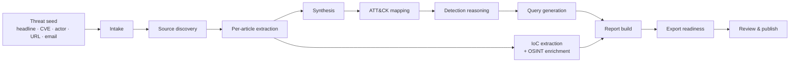
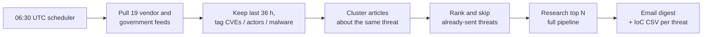

# ThreatLens

**Autonomous threat research for teams that defend many clients at once.**

A threat hunter gives ThreatLens a threat: a headline, a CVE, an actor, a campaign, an article URL or a forwarded vendor email. They pick the client workspaces it matters to. ThreatLens then does the research a hunter would otherwise spend a morning on. It finds and reads the reporting, writes one sourced research record, maps the behaviour to MITRE ATT&CK, writes detection logic in each client's own query language, enriches the indicators, and produces a report that is ready to send. A daily digest also brings the day's emerging threats to your mailbox, already researched and with hunt queries included, before anyone asks.

```
api/   FastAPI + SQLAlchemy backend, pipeline agents, exports, daily digest   (Python 3.12)
web/   Next.js 15 + Tailwind v4 frontend                                      (Node 20+)
```

---

## Why this exists

A threat-hunting team that serves several clients answers the same question many times a day: *"We just read about X. Does it affect our clients, and how do we check?"* Answering it by hand is slow and inconsistent:

| Day-to-day problem | What ThreatLens does about it |
|---|---|
| **Finding out what's new.** Advisories are spread across a dozen vendor blogs, government feeds and newsletters. Someone has to read them all before the day starts. | The **daily emerging-threat digest** checks every allow-listed vendor and government feed. It groups articles about the same threat, ranks them and researches the top few. The result arrives in your inbox. |
| **Reading takes too long.** One threat can mean 5 to 15 articles that repeat, contradict or update each other. | **Source discovery and per-article extraction** read the articles for you. **Synthesis** merges them into one record, flags where sources disagree, and keeps the newest facts. |
| **You can't tell where a claim came from.** Summaries lose the link back to the evidence, so reviewers can't check them and clients can't trust them. | Every claim, technique, indicator and query carries **source provenance** down to the evidence quote. A **grounding gate** blocks publishing while any statement is unsourced. |
| **Behaviour gets lost behind indicators.** IoCs expire in days, but the attacker's techniques don't. | **ATT&CK mapping** and an **attack-path view** show the intrusion step by step. The detections target those behaviours as well as the indicators. |
| **Every client runs a different stack.** One threat needs Splunk for one client, Sentinel for the next and CrowdStrike for the third, each with its own field names. | Detections are written once as **Sigma**, then translated for **10 platforms** (pySigma where a maintained backend exists) and rewritten with **each workspace's field mappings**. |
| **Queries break in production.** A hand-written query fails on a missing log source or a field name. | Every query is **linted**. Each detection records the log sources it needs, and **coverage gaps** show which clients don't collect them. |
| **Indicators are noisy.** Articles contain vendor domains, sample hashes of legitimate binaries, and defanged or broken values. | **IoC extraction** refangs, normalises and filters false positives with allow-lists. **OSINT enrichment** (VirusTotal, AbuseIPDB, GreyNoise, abuse.ch, Shodan, OTX, urlscan) sets a verdict. Analysts can mark false positives, and those hunts regenerate on their own. |
| **Is this relevant to *this* client?** Not every threat applies to every environment. | Each workspace lists its **technology in scope**. ThreatLens works out **applicability** per client and records a per-client **hunt result**: confirmed, suspicious, no evidence or not applicable. |
| **CVE risk is hard to rank.** A CVSS score alone doesn't say whether a vulnerability is being exploited. | **CVE enrichment** pulls NVD (CVSS, affected products), **CISA KEV** (known exploited, due date, ransomware use) and **FIRST EPSS** (exploitation probability). Only the CVE id is ever sent. |
| **Every client wants a different format.** Clients want an email, managers want a PDF or slides, and the TIP needs STIX. | One record exports to **PDF, email HTML/.eml, a 2-slide PPTX, JSON, IoC CSV, STIX 2.1**, and **period summaries** (XLSX + PDF) across a week or month. |
| **The same work gets done twice.** Last month's research on the same actor sits in someone's notes. | Every run feeds shared **libraries** of actors, malware and tools, queries and IoCs. There is **global search** and a **duplicate check** before a new run starts. |

---

## How a research run works



| Stage | What happens | Problem it removes |
|---|---|---|
| **1 · Intake** | Parses the seed into entities (CVEs, actors, malware, keywords) and applies the run's settings: depth, look-back window, target workspaces and platforms, TLP. | No more guessing where to start or how to search. |
| **2 · Source discovery** | Collects candidates from seed URLs, **19 allow-listed vendor and government feeds** (Microsoft, Mandiant, Unit 42, Talos, CrowdStrike, CISA, NCSC and others) and, optionally, Brave web search. Candidates are ranked by relevance and publisher reliability (Admiralty A to F), and syndicated copies are removed. | Finds the authoritative reporting without anyone opening 20 tabs. |
| **3 · Per-article extraction** | Fetches each article (httpx + trafilatura, with headless Chromium for JavaScript-heavy pages) and extracts claims, behaviours and indicators, each with a quote. Private and internal addresses are blocked, so the fetcher can't be used for SSRF. | Reads the sources for you and keeps the evidence. |
| **4 · Synthesis** | Merges the per-article notes into one record: executive summary, impact, actors, malware, vulnerabilities, industries, attack path, recommendations (immediate, short term, strategic). Claims that disagree between sources are flagged. | One coherent story instead of 10 overlapping blog posts. |
| **5 · ATT&CK mapping** | Maps each procedure to a technique and tactic with an evidence quote, validated against the ATT&CK catalogue (bundled subset, or the full Enterprise matrix via **Settings → System → Sync now**). | Consistent, checkable TTP mapping. |
| **6 · Detection reasoning** | Turns behaviours into **detection opportunities** (IoA, TTP, vulnerability, IoC) with the log sources each one needs. | Detections are aimed at behaviour, not only at indicators that expire. |
| **7 · Query generation** | Writes a Sigma rule per opportunity and translates it into each target platform, then lints it. Vendor-published queries are kept and labelled by provenance (*vendor*, *derived*, *generic*). | Ready-to-run hunts in each client's language. |
| **8 · IoC extraction + enrichment** | Runs in parallel with stages 4 to 7. Refangs, normalises, applies allow-lists and known-good hashes, enriches with OSINT and sets a verdict. Also generates retro-hunt queries (IPs, domains, hashes). | Clean indicators with reputation, not a raw paste. |
| **9 · Report build** | Assembles the versioned record (schema v1), per-client applicability and coverage gaps. | One source of truth for the page and every export. |
| **10 · Export readiness** | Runs the grounding gate and readiness checks that the publish step relies on. | Nothing unsourced reaches a client. |

Each stage saves its output, so a failed or edited stage can be **re-run on its own** (**Retry stage**) without starting over. Runs have a **time and token budget** per depth (quick, standard, deep) that warns at 80% and can optionally stop the run.

**LLM and offline modes.** With `ANTHROPIC_API_KEY` set, Claude agents do the intake, extraction, synthesis, ATT&CK mapping, detection reasoning and query writing, using structured outputs. Without a key the whole pipeline still runs in **offline mode** (regex, keyword heuristics and detection templates). That is useful for demos and air-gapped trials, but the narrative text is much weaker. Fetched article text and email content are always passed to the model as **untrusted data**, and the model is told never to follow instructions found in them.

---

## What you work with day to day

### Starting research: three ways in
- **Manual.** **Research → New**: paste a seed, pick workspaces, platforms, depth and TLP. A duplicate check shows existing research on the same CVE or actor before you start.
- **Forward an email.** Send a vendor advisory or a colleague's *"have we looked at this?"* to the intake address (Postmark, SendGrid or Mailgun inbound webhook), or upload an `.eml`. ThreatLens reads the subject and body as the seed, pulls the article links out of tracking redirects, detects CVEs, actors, malware and indicators, and routes the email to the right client by sender domain or `+tag`. It then creates a draft run. Nothing in the email is fetched or followed at intake.
- **Daily digest.** Emerging threats are found and researched automatically every morning. See [Daily emerging-threat digest](#daily-emerging-threat-digest).

### The research record
The research page has several views of the same record, each for a different job:

| View | Use it to |
|---|---|
| **Study** | Read the full write-up: summary, impact, actors, malware, vulnerabilities, recommendations. |
| **Research path** | Follow the intrusion step by step, from initial access to impact, with the techniques and detections for each step. |
| **Tree** and **List** | Browse the whole record as a hierarchy (threat → behaviours → techniques → detections → queries) or as a flat, filterable list. |
| **IoCs** | Review indicators with their reputation, mark false positives or benign values, exclude values from hunts. Hunts regenerate on their own. |
| **Hunts** | Take the mapped queries for the current workspace, copy or run them, and log the outcome per client (confirmed, suspicious, no evidence, not applicable). |
| **Report** | Preview exactly what the client will receive. |
| **Sources and activity** | See every source with its publisher reliability, the run log, and the full edit and review history. |

Every item shows **where it came from**: a source chip that opens the evidence quote. The **tactic rail** shows at a glance which ATT&CK tactics the threat covers.

### Detection engineering
- Output for **Splunk SPL, Microsoft Sentinel KQL, Defender XDR KQL, CrowdStrike CQL, SentinelOne S1QL, Cortex XQL, Elastic ES|QL, Google SecOps YARA-L, QRadar AQL** and **Sigma**.
- **pySigma backends** for SPL, both KQL flavours and ES|QL, and a built-in translator (or the LLM) for the rest.
- **Per-client field mappings.** Queries are rewritten with each workspace's own field and table names at export time, and linted again after mapping.
- **Log-source requirements** per detection and **coverage gaps** per client (for example, *"Northwind has no DNS logs, so 3 hunts can't run there"*).

### Client workspaces
Each client is a workspace with its SIEM and EDR platforms, field mappings, log sources, technology in scope, default TLP and report branding (logo, colour). Switch workspaces from the sidebar. Every page, query and export follows the selected client.

### Review and publish
Hunters draft, and reviewers and leads publish. The **publish gate** checks readiness before anything is published: unsourced claims, citations to unknown sources, evidence quotes that don't match the article, and unresolved source conflicts. Reviewers can edit any section in place. Edited or approved items drop from *block* to *warn*, because a person has taken responsibility for them. Each save creates a **version**, and you can **diff** any two versions. **Comments** with @mentions keep the discussion next to the item it is about.

### Exports
| Format | For |
|---|---|
| PDF | Formal client report with branded header, footer and TLP marking |
| Email HTML / `.eml` | Opens as a ready-to-send Outlook draft (TLP:RED is refused) |
| 2-slide PPTX | Management briefing |
| JSON / IoC CSV | Tooling, SIEM watchlists |
| STIX 2.1 | TIP import (MISP, OpenCTI…). Deterministic IDs, so re-exports update objects instead of duplicating them |
| Period XLSX + summary PDF | Weekly or monthly reporting across all research for a client |

### Libraries, search and dashboards
- **Libraries** for threat actors, malware and tools, queries and IoCs are built up from every run and can be edited as profiles.
- **Global search** (full-text, trigram index) covers research, actors, CVEs, techniques and indicators.
- **Dashboards** show research volume, severity mix, top techniques and actors, hunt outcomes per client, and time to publish.

---

## Daily emerging-threat digest

Every morning ThreatLens emails a digest of the threats that emerged overnight. Each item is already researched for your chosen client, with a summary, the ATT&CK techniques, key indicators and ready-to-run hunt queries.



**How it decides what's "emerging".** Articles that name the same CVE, actor or malware are merged into one threat, so a story covered by Microsoft, Unit 42 and CISA shows up once. Threats are ranked by:
- how many publishers report it (corroboration),
- whether it names a CVE,
- whether a government source (CISA, NCSC) published it,
- whether it names an actor or malware family,
- how recent it is.

Anything sent in the last 7 days is skipped, so tomorrow's digest only contains what's new.

**What each item in the email contains**
- the headline, why it was ranked (for example *"reported by 3 publishers, names a CVE, government advisory"*) and links to every source article
- severity, confidence and TLP, with a clear **unreviewed draft** label
- the executive summary and the **do-now (0 to 48 h)** recommendations
- the ATT&CK techniques involved
- key indicators (defanged), with the full list attached as a **CSV**
- **hunt queries already translated and field-mapped for the digest workspace's platforms**
- a button that opens the full research record, where a reviewer can edit, publish and export it for other clients

Each researched threat is an ordinary draft record, so it can be reviewed, re-run, published and exported like any other research. TLP:RED content is never emailed. If a run fails, the email says so and links to it so the failed stage can be retried.

**Set it up** in `api/.env`:

```ini
DIGEST_ENABLED=true
DIGEST_TIME_UTC=06:30                  # once a day, UTC
DIGEST_RECIPIENTS=soc@yourco.com, you@yourco.com
DIGEST_WORKSPACE_ID=acme               # whose platforms and field mappings the queries use (default: first workspace)
DIGEST_MAX_THREATS=3
DIGEST_LOOKBACK_HOURS=36
DIGEST_AUTO_RESEARCH=true              # false = headlines and links only, no pipeline runs
DIGEST_DEPTH=quick                     # quick | standard | deep

SMTP_HOST=smtp.office365.com           # or smtp.gmail.com, your relay, etc.
SMTP_PORT=587                          # 465 = implicit TLS
SMTP_USER=threatlens@yourco.com
SMTP_PASSWORD=<app password>
SMTP_FROM=ThreatLens <threatlens@yourco.com>
```

Without `SMTP_HOST`, the digest is saved as an `.eml` in `api/data/exports/digests/` instead, which is handy for trying it out. For good digests, set `ANTHROPIC_API_KEY` too, because offline mode produces much weaker summaries.

| Endpoint | Purpose |
|---|---|
| `GET /api/digest` | Configuration, last run and last error |
| `GET /api/digest/preview` | Renders today's digest as HTML without researching, sending or marking anything as sent |
| `POST /api/digest/run` | Sends the digest now (lead or admin) |

> The scheduler runs inside the API process. Run a single API worker, or the digest is sent once per worker. For multi-node deployments, disable it (`DIGEST_ENABLED=false`) and call `digest.run_digest()` from your job scheduler instead.

---

## Quick start (Windows)

```bash
powershell -ExecutionPolicy Bypass -File .\run.ps1
```

On first run the script:
1. creates `api/.venv`,
2. installs the Python and Node dependencies and headless Chromium (used for PDF export and JavaScript-rendered articles),
3. copies `api/.env.example` to `api/.env`,
4. starts the API on :8000 and the web app on :3000.

Open http://localhost:3000.

The database is seeded with three client workspaces (Acme Bank, Northwind Health, Contoso Energy), four users with different roles, the **ToolShell dry-run record** (`TR-2026-0142`) and a few sample records for the dashboards. Switch between hunter, reviewer and lead from the account menu at the bottom of the sidebar. Publishing requires reviewer, lead or admin.

To run each service yourself:

```bash
cd api; .\.venv\Scripts\python.exe -m uvicorn app.main:app --port 8000
```
```bash
cd web; npm run dev
```

### Docker / PostgreSQL

```bash
docker compose up --build
```

This runs PostgreSQL 16, the API and a standalone Next.js build. For a local PostgreSQL without Docker, set `DATABASE_URL=postgresql+psycopg://…` in `api/.env` and `pip install "psycopg[binary]"`.

## Configuration (`api/.env`)

Everything is optional for local use.

| Variable | Effect |
|---|---|
| `ANTHROPIC_API_KEY`, `LLM_MODEL` | Turns on the Claude agents. Without a key the pipeline runs in offline mode. LLM calls use structured outputs and the API's server-side refusal fallback (`fallbacks: "default"`), because legitimate threat research can trip the cyber safety classifier. |
| `BRAVE_SEARCH_API_KEY` | Open-web source discovery. Without it, discovery uses seed URLs plus the vendor feeds. |
| `VIRUSTOTAL_API_KEY`, `ABUSEIPDB_API_KEY`, `GREYNOISE_API_KEY`, `ABUSECH_AUTH_KEY`, `SHODAN_API_KEY`, `OTX_API_KEY`, `URLSCAN_API_KEY` | OSINT enrichment. You can also set these in **Settings → OSINT API keys**, where they are stored encrypted. |
| `NVD_API_KEY`, `CVE_ENRICHMENT` | CVE enrichment (NVD, CISA KEV, EPSS). A key raises the NVD rate limit. |
| `DIGEST_*`, `SMTP_*` | Daily emerging-threat digest (see above). |
| `INTAKE_WEBHOOK_SECRET` | Turns on the inbound-email webhook (`/api/intake/inbound`). |
| `AUTH_MODE`, `AUTH_HEADER`, `AUTH_TRUSTED_PROXIES` | `dev` (user switcher) or `header` (identity from an OIDC proxy such as oauth2-proxy). |
| `THREATLENS_SECRET_KEY` | Encryption key for secrets stored in the database. Generated into `data/.secret_key` if unset. |
| `DATABASE_URL` | SQLite by default (`api/threatlens.db`). |
| `WEB_BASE_URL` | Base URL for the "Open the full report" links in exports and the digest. |
| `RUN_BUDGETS`, `BUDGET_ENFORCE` | Time and token budget per run depth. Set `BUDGET_ENFORCE` to stop runs that go over. |

## Where things live in the code

| Area | Implementation |
|---|---|
| Pipeline (10 stages, per-stage retry, parallel IoC branch, budgets) | `api/app/pipeline/runner.py`, `stages.py`, `schemas.py` |
| Source discovery, fetching, SSRF guard | `api/app/sources.py` |
| LLM client and untrusted-content handling | `api/app/llm.py` |
| Grounding gate and publish readiness | `api/app/guardrails.py`, `routers/research.py` |
| Detection engineering (Sigma → 10 platforms, lint, mappings, coverage) | `api/app/detection.py`, `sigma_backends.py` |
| IoC extraction, refang/defang, allow-lists; OSINT verdicts | `api/app/ioc.py`, `osint.py`, `routers/ioc_review.py` |
| CVE enrichment (NVD, KEV, EPSS) | `api/app/vulns.py` |
| Email intake (forward-to-run) | `api/app/intake.py`, `routers/intake.py` |
| **Daily emerging-threat digest** | `api/app/digest.py`, `routers/digest.py`, `exports/templates/digest.html` |
| Exports (PDF, email, PPTX, JSON, CSV, STIX, period) | `api/app/exports/*` |
| Data model; libraries; dashboards; audit | `api/app/models.py`, `records.py`, `routers/library.py`, `routers/dashboard.py`, `audit.py` |
| Seed data and ToolShell dry run | `api/app/seed.py` |
| Web app: shell, workspace switcher, command palette | `web/src/components/shell/*`, `providers.tsx` |
| Web app: research views (study, path, tree, list, IoCs, hunts, report) | `web/src/components/research/**`, `web/src/app/**` |
| Design system tokens and components | `web/src/app/globals.css`, `web/src/components/ui/*` |

## Tests

```bash
cd api; .\.venv\Scripts\python.exe -m pytest tests -q
```

The suite is network-free. It covers the seed data, library and search APIs, detection translation and lint for every platform, IoC refang/defang and review, CVE enrichment (mocked), all exports including STIX, email intake, the review and publish workflow, auth modes, run budgets, a full offline pipeline run, re-running a single stage, and the daily digest (clustering, ranking, de-duplication, rendering and delivery).

## Trust and safety model

- **Untrusted content stays data.** Article text, feed entries and emails are parsed and shown back, but never executed or followed. The LLM is told explicitly not to follow instructions inside them.
- **Nothing client-identifying leaves the building.** OSINT and CVE lookups send only public indicators and CVE ids, never client names or record content.
- **Evidence before publishing.** The grounding gate blocks publishing while any statement lacks a source, and a person must approve anything they have edited.
- **Safe fetching.** Fetchers never log in or submit forms, and private, loopback and link-local addresses are blocked (SSRF guard).
- **TLP respected.** TLP:RED content is never emailed, by the email export or by the digest.
- **Secrets encrypted at rest.** Keys stored in the database are Fernet-encrypted and never returned by the API. Every view, edit and export is logged in an audit trail.

## Notes and deliberate simplifications

- **Auth.** Use `AUTH_MODE=header` behind an OIDC proxy in production. Native OIDC token validation is not built yet. `dev` mode trusts the user switcher and is for local use only.
- **Job queue.** Stages and the digest scheduler run in-process. For multi-node deployments, move `execute_run(run_id, from_stage)` and `digest.run_digest()` onto Celery or Arq. A run interrupted by an API restart is marked failed and can be resumed with **Retry stage**.
- **ToolShell seed record.** The indicators are the publicly reported ones. The evidence quotes are paraphrased, and OSINT reputation stays empty until keys are added. Verify against the linked articles before any client use.
- **Colour palette.** Charts label categories directly and never rely on colour alone, because some design-system colours sit close together for colour-vision-deficient readers.
- **Not built yet:** lab validation of queries against sample telemetry, actor and CVE watchlists, MISP push (STIX export works today), and a settings page for the digest (it is configured in `.env` for now).
